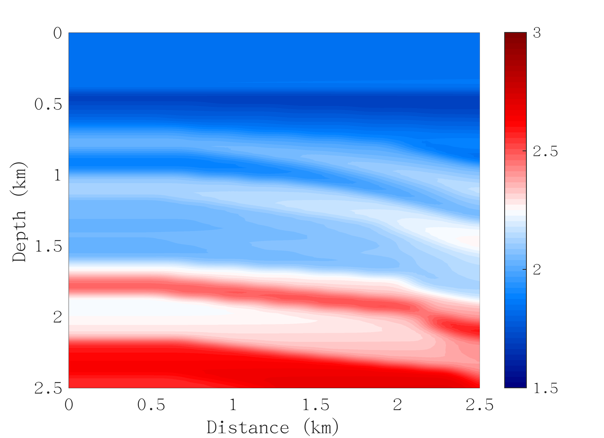
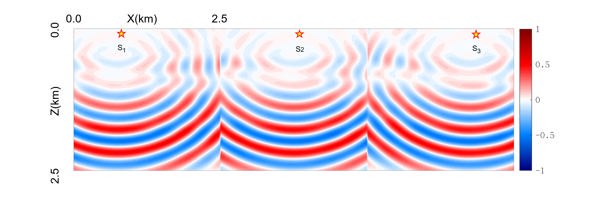
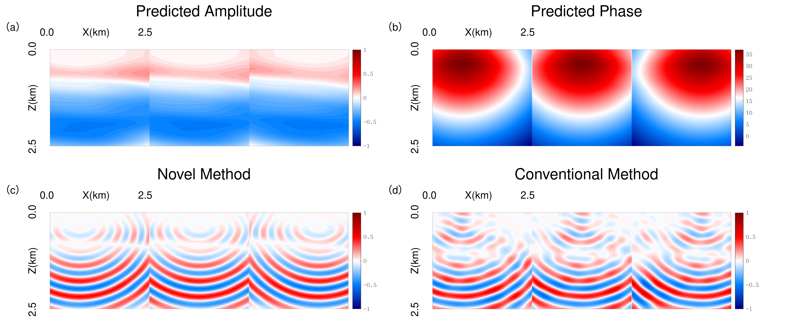

# PINN-based Seismic Wavefield Simulation for Helmholtz Equation Parameterized by Amplitude and Unwrapped Phase

This repository contains the partial source code and execution results for the paper **"PINN-based Seismic Wavefield Simulation for Helmholtz Equation Parameterized by Amplitude and Unwrapped Phase"**. The paper is currently under review in the journal *Geophysics*.
---

## 💡 Methodology Highlights

When solving the frequency-domain Helmholtz equation, conventional Physics-Informed Neural Networks (PINNs) struggle to fit the severe spatial oscillations of complex-valued wavefields due to the spectral bias of neural networks.

This project proposes a novel **reparameterized scattered Helmholtz equation**. By decoupling the wavefield into **Amplitude** and **Unwrapped Phase**, we transform the task of fitting high-frequency oscillations into a smooth function fitting task, at which neural networks excel. Experiments demonstrate that this method achieves a significant improvement in computational accuracy for both 2D and 3D complex models, even when using simple fully connected networks.

---

## 🔒 Repository Status: Phased Release

To protect core intellectual property prior to formal publication, this repository is currently in a **phased release** state.

**✅ Currently Available (Review Phase):**
* **`architecture/`**: The PINN backbone network architecture and activation function configurations used in the paper.
* **`results/`**: The output results of the novel loss function and the conventional loss function.

**🚀 Upcoming (To be open-sourced immediately upon official publication):**
* **Core Loss Function**: The novel loss function based on the  **Helmholtz Equation Parameterized by Amplitude and Unwrapped Phase**.

---
### Overview of Numerical Experiments

To comprehensively evaluate the superiority of the proposed method compared to the conventional loss function, we conducted **5 core numerical experiments** in the paper. The results fully demonstrate that, even when utilizing a simple fully connected neural network, our method can achieve a significant improvement in accuracy across velocity models of varying complexity. The experiments cover both 2D multi-source and 3D single-source wavefield simulations:

1. **2D Layered Model Baseline Test (5 Hz, 30,000 sampling points)**: Based on the layered velocity field from the Sigsbee2A model, this test verifies the distinct advantages of the novel loss function over the conventional method in terms of convergence speed and multi-source wavefield reconstruction accuracy.
2. **2D Layered Model Sparse Sampling Test (5 Hz, 3,000 sampling points)**: By drastically reducing the training samples to one-tenth of the original scale, this test verifies the strong robustness of the proposed method under the condition of extremely few spatial collocation points.
3. **2D Layered Model High-Frequency Test (10 Hz, 60,000 sampling points)**: By increasing the simulation frequency, this test specifically verifies the effectiveness of the proposed method in overcoming the severe spatial oscillations of high-frequency wavefields and mitigating the severe spectral bias problem of neural networks.
4. **2D Overthrust Complex Model Test (4 Hz, 180,000 sampling points)**: Within the complex Overthrust structural model featuring strong lateral heterogeneity, this test verifies the feasibility and outstanding performance of the new method in multi-source simulations for complex media compared to the conventional method.
5. **3D Overthrust Complex Model Test (8 Hz, 80,000 sampling points)**: Extending the theoretical framework into three-dimensional space, this test successfully verifies its high efficiency and high precision in single-source wavefield simulations for 3D complex media.
---
### Core Visualizations

The following presents the comparative results of the 5 Hz frequency-domain wavefield simulation for the layered model with 3,000 sampling points: The first row shows the velocity model and the reference wavefield calculated based on the finite difference method (FDM). The second row displays the amplitude and unwrapped phase predicted by our novel PINN method, along with a comparison of its reconstructed wavefield against the conventional method.

<div align="center">
  <table style="text-align: center;">
    <tr>
      <td style="width: 30%; text-align: right; padding-right: 10px;">
        <b>Velocity Model</b><br>
        
      </td>
      <td style="width: 70%; text-align: left; padding-left: 10px;">
        <b>Reference Wavefield (FDM)</b><br>
        
      </td>
    </tr>
    <tr>
      <td colspan="2" style="text-align: center; padding-top: 15px;">
        <b>PINN Predicted Results Comparison</b><br>
        <i>(a) Predicted Amplitude &nbsp; (b) Predicted Unwrapped Phase &nbsp; (c) Novel Method Wavefield &nbsp; (d) Conventional Method Wavefield</i><br>
        
      </td>
    </tr>
  </table>
</div>

---
###  ⚙️ Environment Setup

The code is implemented in Python using TensorFlow 2.4.0. To ensure the reproducibility of the experimental results, the code execution is restricted to a deterministic computational mode.

**Dependencies:**
* Python 3.7.16
* TensorFlow 2.4.0
* cuda 10.1
* NumPy 1.21.5
* SciPy, h5py, Matplotlib

**Quick Installation:**
```bash
pip install tensorflow==2.4.0 numpy==1.21.5
pip install scipy h5py matplotlib
```
